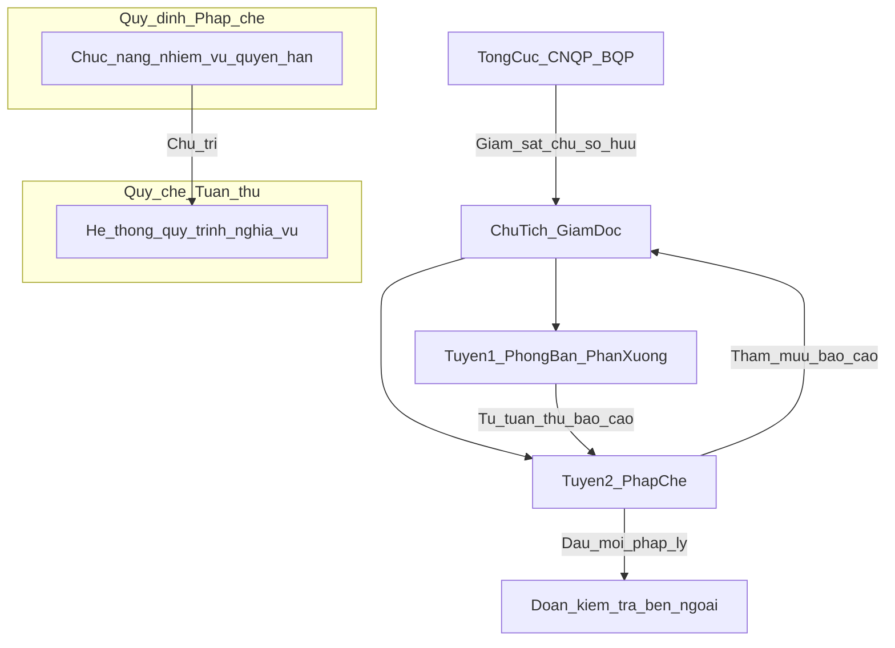

# Kế hoạch xây dựng Quy chế Tuân thủ
## (Công ty TNHH MTV do Nhà nước nắm giữ 100% vốn — DN quân đội thuộc Tổng cục Công nghiệp quốc phòng / Bộ Quốc phòng)

## Mục tiêu

Xây dựng **Quy chế Tuân thủ** của Doanh nghiệp, song hành với [Quy định Pháp chế](02-Quy-dinh-Phap-che.md) đã ban hành, bảo đảm:

- Thể thức, ngôn ngữ văn bản pháp lý nội bộ chuyên nghiệp.
- Tham chiếu căn cứ pháp lý hiện hành cụ thể (cả khung DNNN và khung DN thuộc BQP).
- Song hành, không chồng chéo với Quy định chức năng–nhiệm vụ–quyền hạn Pháp chế:
  - **Quy định Pháp chế** = *ai làm gì* (chức năng, nhiệm vụ, quyền hạn của Pháp chế).
  - **Quy chế Tuân thủ** = *doanh nghiệp tuân thủ như thế nào* (hệ thống, quy trình, nghĩa vụ của mọi đơn vị/cá nhân).

---

## Bối cảnh đơn vị đã chốt (cập nhật theo xác nhận của đơn vị)

| Hạng mục | Nội dung đã chốt |
|----------|------------------|
| Loại hình | **Công ty TNHH một thành viên** do Nhà nước nắm giữ 100% vốn điều lệ |
| Chủ sở hữu | Nhà nước; đại diện chủ sở hữu: **Tổng cục Công nghiệp quốc phòng / Bộ Quốc phòng** |
| Bản chất | Đồng thời là **Doanh nghiệp nhà nước** và **Doanh nghiệp quân đội** — không tách rời hai loại hình |
| Kiểm toán nội bộ / Thanh tra độc lập | **Không có** bộ phận Kiểm toán nội bộ hoặc Thanh tra độc lập tại đơn vị |
| Đầu mối tuân thủ | **Pháp chế (Trợ lý pháp chế)** chủ trì, tham mưu trực tiếp lãnh đạo |
| Trạng thái khung | Đơn vị đang rà soát khung Chương–Điều; sẽ góp ý bổ sung trước khi soạn toàn văn |

---

## Cơ sở pháp lý tham chiếu (dự kiến ghi tại phần Căn cứ)

| Văn bản | Vai trò với Quy chế Tuân thủ |
|---------|------------------------------|
| Luật Doanh nghiệp 2020 | Tổ chức, quản lý công ty TNHH MTV; trách nhiệm người quản lý |
| Luật Quản lý và đầu tư vốn nhà nước tại doanh nghiệp số **68/2025/QH15** | Nghĩa vụ tuân thủ PL; giám sát, báo cáo, công khai thông tin; quản lý vốn/tài sản NN |
| Nghị định **365/2025/NĐ-CP** (và văn bản hướng dẫn) về giám sát, kiểm tra, đánh giá, xếp loại, báo cáo, công khai thông tin | DN tự tổ chức hệ thống kiểm soát nội bộ; nghĩa vụ báo cáo chủ sở hữu |
| Nghị định **55/2011/NĐ-CP**, sửa đổi **56/2024/NĐ-CP** | Pháp chế DNNN: theo dõi, đôn đốc, kiểm tra thực hiện PL; đánh giá tuân thủ |
| Thông tư **79/2013/TT-BQP** | Công tác pháp chế DN thuộc BQP; quan hệ với Vụ Pháp chế BQP |
| Các quy định của Bộ Quốc phòng, Tổng cục Công nghiệp quốc phòng | Quản lý DN quân đội, CNQP, bảo mật, đất quốc phòng, tài sản công… |
| Luật PCTN, Luật Bảo vệ bí mật nhà nước, Luật An ninh mạng, Luật Đấu thầu, Luật Lao động, Luật Kế toán… | Các nhóm lĩnh vực tuân thủ chuyên ngành |
| Điều lệ DN; Quy định Pháp chế đã ban hành | Liên thông nội bộ |

**Ghi chú về Nghị định 05/2019/NĐ-CP (kiểm toán nội bộ):** Không lấy làm căn cứ tổ chức bộ máy KTNB tại đơn vị (đơn vị không có chức năng này). Khi soạn toàn văn, chỉ viện dẫn ở mức **phân định khái niệm** (tuân thủ ≠ kiểm toán nội bộ) nếu cần, và quy định cơ chế **phối hợp khi cơ quan chủ quản / đoàn kiểm toán, thanh tra bên ngoài** làm việc tại đơn vị.

---

## Định hướng thiết kế (đã điều chỉnh)

1. **Chủ thể:** toàn Doanh nghiệp — mọi Phòng/Ban/Phân xưởng và người lao động; Pháp chế là **đầu mối chủ trì** công tác tuân thủ (khớp Điều 18 Quy định Pháp chế).
2. **Mô hình tổ chức tuân thủ — 2 tuyến nội bộ + giám sát bên ngoài** (thay cho mô hình 3 tuyến có KTNB):
   - **Tuyến 1:** Phòng/Ban/Phân xưởng tự tuân thủ, tự kiểm soát trong lĩnh vực được giao.
   - **Tuyến 2:** Pháp chế giám sát tuân thủ, tham mưu rủi ro pháp lý, tổng hợp báo cáo.
   - **Giám sát bên ngoài:** Tổng cục CNQP / BQP, cơ quan thanh tra–kiểm toán–kiểm tra theo thẩm quyền (không phải bộ phận nội bộ của DN).
3. **Phạm vi tuân thủ:** pháp luật; Điều lệ, quy chế nội bộ; quy định BQP và Tổng cục CNQP; nghĩa vụ báo cáo–công khai thông tin vốn nhà nước; yêu cầu bảo mật quân sự / bí mật nhà nước.
4. **Không thay thế:** chức năng chuyên môn của các Phòng/Ban (TCKT, KH–KD, TCLĐ, HC–HC…); không giả định có KTNB/Thanh tra nội bộ.
5. **Cấp ban hành dự kiến:** Chủ tịch công ty / Giám đốc (theo Điều lệ) — placeholder `[Tên doanh nghiệp]`, `[Chức danh người ký]`.

---

## Khung Chương – Điều đề xuất (đã chỉnh theo bối cảnh)

### Phần mở đầu
- Quốc hiệu, tiêu ngữ; tên DN; tên văn bản.
- Quyết định ban hành kèm Quy chế.
- Căn cứ pháp lý (bảng trên), nêu rõ loại hình Công ty TNHH MTV do Nhà nước nắm giữ 100% vốn; đại diện chủ sở hữu là Tổng cục CNQP/BQP.

### Chương I. QUY ĐỊNH CHUNG (Điều 1–6)
| Điều | Tên | Tóm tắt |
|------|-----|---------|
| 1 | Phạm vi điều chỉnh | Hệ thống tuân thủ; nguyên tắc, nội dung, trách nhiệm, quy trình kiểm soát–báo cáo–xử lý |
| 2 | Đối tượng áp dụng | Lãnh đạo; Pháp chế; Phòng/Ban/PX; người lao động; bên thứ ba theo hợp đồng (nếu áp dụng) |
| 3 | Giải thích từ ngữ | Tuân thủ; hệ thống tuân thủ; rủi ro tuân thủ; nghĩa vụ tuân thủ; vi phạm tuân thủ; báo cáo tuân thủ; danh mục VBQPPL áp dụng; đại diện chủ sở hữu… |
| 4 | Mục tiêu của công tác tuân thủ | Bảo đảm chấp hành PL; bảo vệ vốn/tài sản NN; bảo đảm yêu cầu QP–bảo mật; giảm rủi ro; nâng cao văn hóa tuân thủ |
| 5 | Nguyên tắc | Tuân thủ đầy đủ; phòng ngừa là chính; phân định trách nhiệm theo 2 tuyến nội bộ; minh bạch–báo cáo trung thực; bảo mật; phối hợp với cơ quan chủ quản |
| 6 | Quan hệ với Quy định Pháp chế và văn bản nội bộ khác | Pháp chế chủ trì; đơn vị chuyên môn chịu trách nhiệm lĩnh vực; liên thông lấy ý kiến pháp lý |

### Chương II. TỔ CHỨC HỆ THỐNG TUÂN THỦ (Điều 7–11)
| Điều | Tên | Tóm tắt |
|------|-----|---------|
| 7 | Mô hình tổ chức tuân thủ | **2 tuyến nội bộ** (đơn vị chuyên môn – Pháp chế) + quan hệ với giám sát của chủ sở hữu/cơ quan có thẩm quyền; **không bố trí KTNB/Thanh tra độc lập** |
| 8 | Trách nhiệm của Chủ tịch công ty, Giám đốc / Ban Giám đốc | Ban hành chính sách; bảo đảm nguồn lực; chỉ đạo xử lý vi phạm trọng yếu; báo cáo Tổng cục CNQP/BQP theo quy định |
| 9 | Trách nhiệm của Pháp chế (đầu mối tuân thủ) | Xây dựng/duy trì hệ thống; cập nhật PL; đánh giá rủi ro tuân thủ; giám sát; PBPL; báo cáo tuân thủ; đầu mối làm việc với đoàn kiểm tra bên ngoài về khía cạnh pháp lý–tuân thủ |
| 10 | Trách nhiệm của các Phòng/Ban/Phân xưởng | Tự kiểm soát; thực hiện nghĩa vụ lĩnh vực; báo cáo sớm rủi ro/vi phạm; phối hợp kiểm tra |
| 11 | Trách nhiệm của người lao động | Chấp hành; từ chối thực hiện yêu cầu trái PL; báo cáo vi phạm theo kênh quy định |

### Chương III. NỘI DUNG VÀ LĨNH VỰC TUÂN THỦ (Điều 12–15)
| Điều | Tên | Tóm tắt |
|------|-----|---------|
| 12 | Nhóm nghĩa vụ tuân thủ chung | PL; Điều lệ; quy chế nội bộ; quy định BQP/Tổng cục CNQP; liêm chính, PCTN |
| 13 | Các lĩnh vực tuân thủ trọng yếu | DN–thương mại–ĐT–đấu thầu–cạnh tranh; lao động–BHXH; vốn NN–kế toán–thuế; QP–động viên CNQP; bí mật NN/QS–ANM; XNK–CL–NTD; đất đai–tài sản công… *(khớp Điều 18 Quy định Pháp chế)* |
| 14 | Danh mục văn bản / nghĩa vụ áp dụng | Xây dựng, cập nhật danh mục; phân công đơn vị chủ trì theo lĩnh vực (Phụ lục) |
| 15 | Yêu cầu đặc thù DNNN đồng thời là DN quân đội | Quản lý vốn–tài sản NN; chế độ báo cáo–công khai với chủ sở hữu; bảo mật; hợp đồng/dự án có yếu tố QP hoặc đối tác nước ngoài; chấp hành chỉ đạo của Tổng cục CNQP/BQP |

### Chương IV. QUY TRÌNH QUẢN LÝ TUÂN THỦ (Điều 16–22)
| Điều | Tên | Tóm tắt |
|------|-----|---------|
| 16 | Nhận diện và đánh giá rủi ro tuân thủ | Định kỳ/đột xuất; xếp mức rủi ro; ưu tiên kiểm soát |
| 17 | Cập nhật pháp luật và điều chỉnh nội bộ | Theo dõi VB mới (Nhà nước + BQP); đánh giá ảnh hưởng; đề xuất sửa quy chế/quy trình |
| 18 | Kiểm soát tuân thủ trong hoạt động thường xuyên | Rà soát trước quyết định; lấy ý kiến Pháp chế theo danh mục bắt buộc; tự kiểm của đơn vị |
| 19 | Giám sát, kiểm tra tuân thủ nội bộ | Kế hoạch năm do Pháp chế tham mưu; kiểm tra theo rủi ro do lãnh đạo giao; **không phụ thuộc KTNB nội bộ**; phối hợp khi có đoàn kiểm tra/thanh tra/kiểm toán bên ngoài |
| 20 | Báo cáo tuân thủ | Báo cáo định kỳ (6 tháng/năm hoặc theo yêu cầu chủ sở hữu) và đột xuất; luồng: đơn vị → Pháp chế → lãnh đạo → Tổng cục CNQP/BQP (khi thuộc chế độ báo cáo) |
| 21 | Xử lý vi phạm và khắc phục | Phân loại; trình tự xử lý; biện pháp khắc phục; lưu hồ sơ |
| 22 | Phổ biến, đào tạo, xây dựng văn hóa tuân thủ | Chương trình PBPL–tuân thủ; đối tượng; tần suất |

### Chương V. CƠ CHẾ BÁO CÁO, KÊNH PHẢN ÁNH VÀ BẢO VỆ NGƯỜI BÁO CÁO (Điều 23–25)
| Điều | Tên | Tóm tắt |
|------|-----|---------|
| 23 | Kênh báo cáo rủi ro / vi phạm tuân thủ | Qua cấp trên trực tiếp, Pháp chế, kênh nội bộ khác do lãnh đạo quy định |
| 24 | Tiếp nhận, xác minh, phản hồi | Thời hạn; phân loại; chuyển xử lý |
| 25 | Bảo vệ người báo cáo thiện chí | Cấm trả đũa; bảo mật danh tính trong phạm vi pháp luật cho phép |

### Chương VI. PHỐI HỢP, HỒ SƠ VÀ ĐIỀU KIỆN BẢO ĐẢM (Điều 26–28)
| Điều | Tên | Tóm tắt |
|------|-----|---------|
| 26 | Phối hợp liên phòng và với cơ quan bên ngoài | KH–KD, TCLĐ, TCKT, HC–HC; Tổng cục CNQP, Vụ Pháp chế BQP, đoàn thanh tra/kiểm toán/kiểm tra bên ngoài |
| 27 | Quản lý hồ sơ tuân thủ | Hồ sơ đánh giá rủi ro, kiểm tra, báo cáo, xử lý vi phạm; thời hạn lưu; chế độ mật |
| 28 | Nguồn lực và điều kiện bảo đảm | Nhân sự Pháp chế; kinh phí; công cụ; quyền tiếp cận thông tin |

### Chương VII. KHEN THƯỞNG, XỬ LÝ VI PHẠM VÀ TỔ CHỨC THỰC HIỆN (Điều 29–32)
| Điều | Tên | Tóm tắt |
|------|-----|---------|
| 29 | Khen thưởng | Theo quy chế thi đua–khen thưởng |
| 30 | Xử lý vi phạm Quy chế | Kỷ luật; bồi thường; chuyển cơ quan có thẩm quyền nếu đủ dấu hiệu |
| 31 | Sửa đổi, bổ sung | Thẩm quyền; Pháp chế đầu mối tổng hợp |
| 32 | Hiệu lực thi hành | Ngày hiệu lực; trách nhiệm thi hành; bãi bỏ quy định trái |

### Phụ lục đề xuất
| Phụ lục | Nội dung |
|---------|----------|
| PL1 | Ma trận phân công tuân thủ theo lĩnh vực (đơn vị chủ trì – phối hợp – Pháp chế) |
| PL2 | Mẫu Báo cáo tuân thủ định kỳ |
| PL3 | Mẫu Phiếu nhận diện / đánh giá rủi ro tuân thủ |
| PL4 | Mẫu Báo cáo sự vụ / phản ánh vi phạm tuân thủ |
| PL5 | Danh mục lĩnh vực & văn bản trọng yếu cần theo dõi (khung mở, cập nhật định kỳ) |

---

## Phân biệt rõ với Quy định Pháp chế (tránh chồng chéo)

---

## Phương pháp triển khai tiếp theo

1. **Vòng 1 (hiện tại):** Đơn vị rà soát khung; góp ý chỉnh sửa Chương–Điều / Phụ lục nếu cần.
2. **Vòng 2:** Sau khi chốt khung → soạn toàn văn theo thứ tự Chương I → VII → Phụ lục.
3. **Vòng 3:** Rà soát liên thông với Quy định Pháp chế (Điều 5, 18, 20–28).
4. **Vòng 4:** Hoàn thiện Quyết định ban hành + Quy chế + Phụ lục; đẩy lên GitHub.

---

## Việc đang chờ đơn vị

- Rà soát khung 7 Chương / 32 Điều / 5 Phụ lục (phiên bản đã điều chỉnh theo bối cảnh TNHH MTV – Tổng cục CNQP/BQP; **không có KTNB/Thanh tra nội bộ**).
- Góp ý bổ sung, sửa đổi, đổi tên Điều (nếu có).
- Sau khi chốt: yêu cầu soạn toàn văn.
